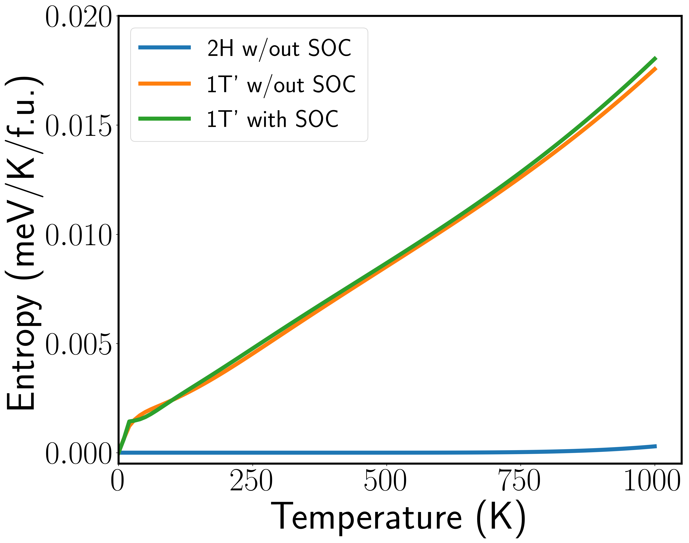
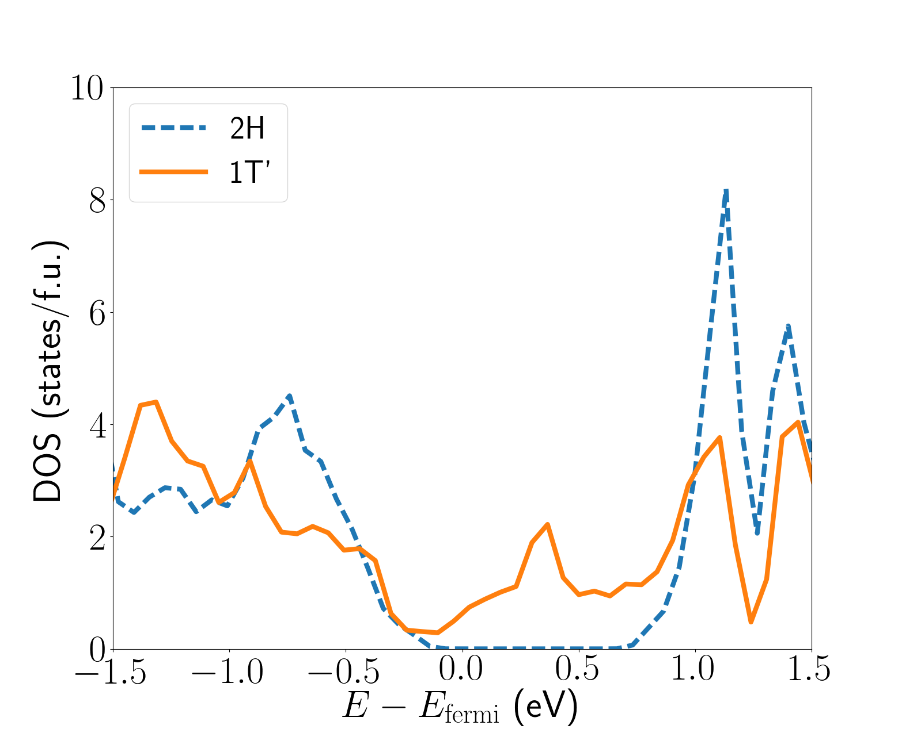
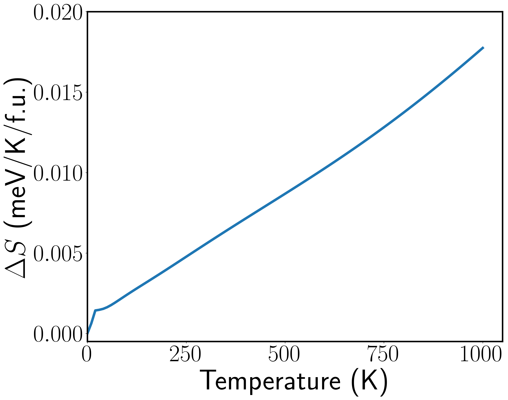

# Electron entropy calculations

This folder provides all files necessary to generate compute the
electronic entropy of 2H and 1T' phases from Fermi smearing
impelemented in VASP.  The `setup.py` file generates 101 folders in
each of the 2H and 1T' directories with names `Txxx0`, corresponding
to the temperature of each calculation, specified by the keyword
`SMEAR` in each INCAR file of each `Txxx0` directory. We provide
`T0100` in each of the 2H and 1T' folders as an example.  The OUTCAR
files generated from the VASP calculations contain the information
needed to extract the entropy at a given temperature. However, we do
not provide the OUTCAR files due to their size.


## Results
These calculations implement non-colinear spin-orbit (SOC) coupling,
just like the rest of the VASP calculations. However, the differences
in electronic enropy computed with and without SOC are very slight, as
also shown here:



Note also from the above figure that 2H-MoTe2 has a negligible entropy
contribution for temperatures up to ~900 K or higher, as shown in the
figure below. This is due to the bandgap of 2H phase MoTe2, so that
only at very high temperatures do electronic states find their way
into the conduction band. To see this, see the below plot of the
electronic density of states for 2H and 1T' phases



The entropy difference between the 2H and 1T' phases is shown
below. It is essentially equal to the 1T' entropy.




## File descriptions
There are 3 Python files in this directory:

- `setup.py`: Generates the 2H and 1Tp folders and `Txxx0`
  sub-folders. Each sub-folder corresponds to a different simulation
  at a given temperature.
- `vaspinput.py`: Used by `setup.py` to generate INCAR and POSCAR
  files for the 2H and 1T' phases
- `getEntropy.py`: Does all post-processing of data and generates the
  figures showing entropy above.

## Example to run
To setup folders, do the following:

```bash
$ python setup.py folders  # generate temperature folders
$ python setup.py run      # submit SLURM script to run 2H and 1T' calculations
```

After simulations finish running, do the following:

```bash
$ python getEntropy.py
```

to generate figures.
