# Computation of Voltage-Excess Charge Diagram

Here we elaborate on the computation of the Voltage-excess
charge diagram for monolayer MoTe2 under conditions of constant
zero stress. This was done for the capacitor structure shown below.

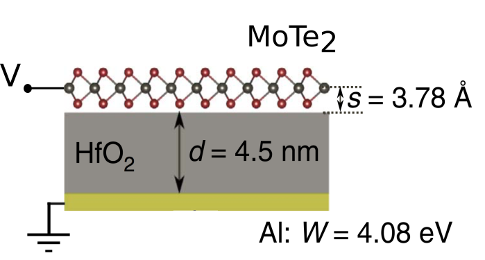

This shows a dielectric of HfO2 of thickness _d_=4.5 nm,
an Aluminum electrode of work function _W_ = 4.08 eV, and the MoTe2
monolayer is a distance _s_ from the dielectric. The capacitor
structure is gated at voltage V, and charge is allowed to flow to
the monolayer.

The total energy of this capacitor setup is

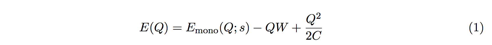

where _Emono_ is the energy of the monolayer at fixed
distance _s_ from the dielectric, _-QW_ is the energy of the metal
electrode, and _Q^2/2C_ is the energy stored in the dielectric.

The grand potential _\PhiG_ for this case is

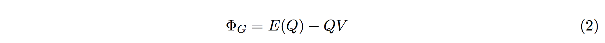

The energy _E(Q)_ is shown in the figure labeled **a** and _\Phi_G_ is shown in the figure labeld **b** below

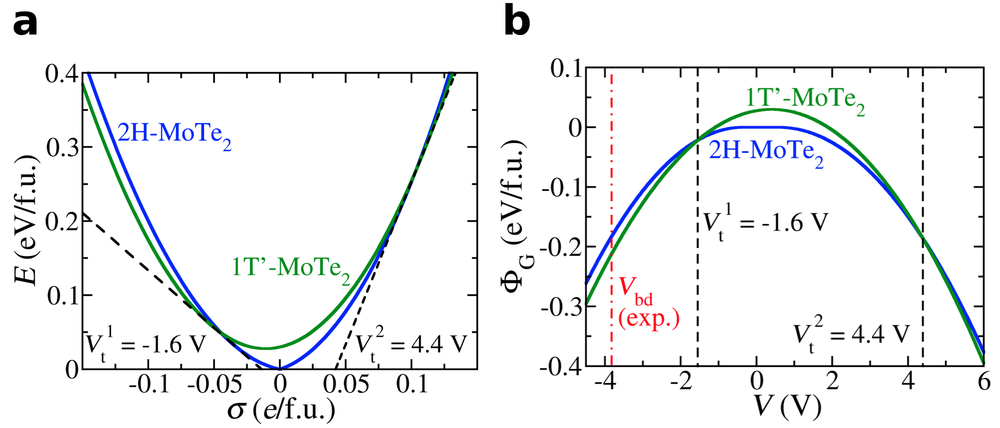

The question now is how we compute the voltage-excess charge diagram
in the follow-up paper to our original electrostatic gating paper
(ref. [1]). This voltage-excess charge diagram is shown below.

In order to compute the Voltage-excess charge phase diagram, we find
stationary points of the grand potential, evaluated at the equilibrium
charge _Qeq_,

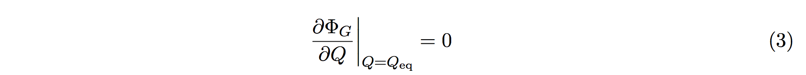

This condition becomes

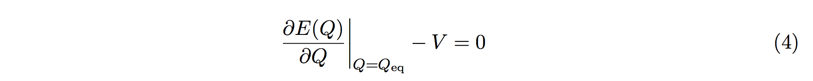

or

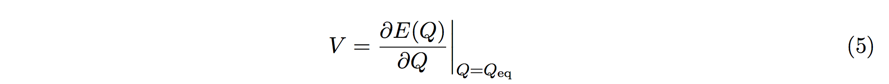

Looking at figure **a**, we can intuitively think of the
Voltage-excess charge diagram below as being the
derivative of figure **a**.

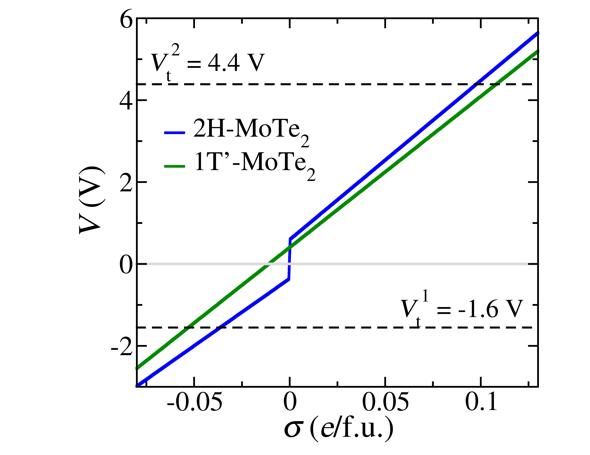

Of course, we can also write out a full expression for _V_ based on
Equation 5,

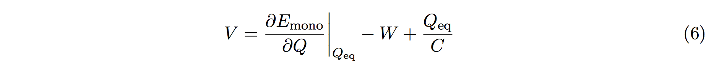

In what follows, we ignore the `eq' in the subscript of _Qeq_ for simplicity.

___

An important side note here is that the capacitance _C_ has a
dependence on the dielectric thickness _d_,

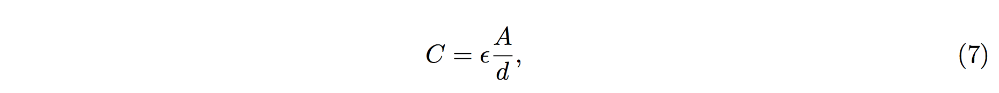

where _\epsilon_ is the dielectric constant and _A_ is the area of the
capacitor (assumed to be fixed). Therefore, we can intutively
understand Figures 5-6 in ref. [1], which consider the
transition voltage when varying the capacitor thickness _d_,

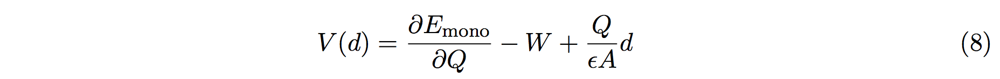

This allows us to make sense of the linear slope shown in Figures 5
and 6 of ref. [1]. Note that the dependence on the work function
_W_ shown in those figures can also be understood via a
Equation 8.

___

Now we return to discussion of Equation 6. Specifically, we
can use this equation to understand the negative curvature of the
grand potential figure. Upon plugging
Equation 6 into Equation 2, while also plugging
in Equation 1, we find

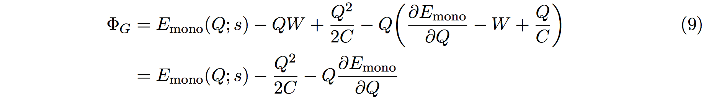

The second term illustrates the quadratic behavior shown in the plot of Phi_G.

## References
[1] Li, Y., Duerloo, K.-A. N., Wauson, K. & Reed, E. J. Structural
semiconductor-to-semimetal phase transition in two-dimensional
materials induced by electrostatic gating. _Nature Communications_
**7**, 10671 (2016).
